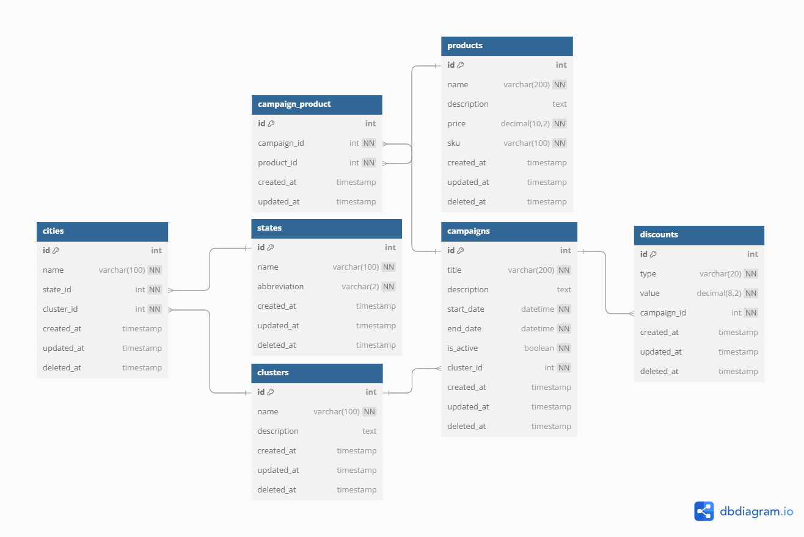

# 📦 SpaGc

A API gerencia estados, cidades, clusters (grupos de cidades), campanhas, produtos e descontos, com relacionamentos e regras de negócio bem definidas.

---

## 🚀 Tecnologias Utilizadas

- PHP 8.2
- Laravel 10
- MySQL 8
- Laravel Sail (Docker)
- Design Orientado a Domínio (DDD leve)
- PSR-4 Autoload
- Scramble (Documentação automática)

---

## 📁 Estrutura de Pastas

```
app/
├── Domain/           # Entidades e interfaces de repositórios
├── Application/      # Regras de negócio (Services)
├── Infrastructure/   # Repositórios concretos
├── Http/             # Controllers, Resources, Requests
├── Models/           # Eloquent Models
routes/
└── api.php           # Rotas da API
```

## 📦 Funcionalidades
✅ **Estados (`states`)**
-   Cadastro e gerenciamento dos **estados brasileiros**.
-   Usados como referência para o cadastro de cidades.
-   Campos: `name`, `abbreviation` (sigla única).
📌 _Exemplo_: `São Paulo - SP`

✅ **Cidades (`cities`)**
-   Cada cidade pertence a um **estado** e a um **cluster** (grupo de cidades).
-   Nome da cidade é **único dentro de um estado**.
📌 _Exemplo_: `Ribeirão Preto` → Estado: SP | Cluster: Interior Paulista

✅ **Clusters (`clusters`)**
-   Representam **agrupamentos estratégicos de cidades**.    
-   Cada cidade pertence a um único cluster.    
-   Cada cluster pode ter várias campanhas, mas apenas **uma campanha ativa por vez**.
📌 _Exemplo_: `Interior Paulista`, `Sul Catarinense`

✅ **Campanhas (`campaigns`)**
-   Representam ações promocionais vinculadas a **um cluster**.    
-   Contêm título, descrição, data de início/fim, e status de ativação.    
-   **Regra de negócio**: apenas **uma campanha ativa por cluster**.
📌 _Exemplo_:  ` "Promoção Semana do Consumidor" – ativa de 12/03 a 18/03 no cluster Interior Paulista.`

✅ **Descontos (`discounts`)**
-   Vínculo direto com uma **campanha**.    
-   Tipos:    
    -   `percentage`: desconto percentual (%)        
    -   `fixed`: valor fixo em reais        
-   Validação de valor ≥ 0.
📌 _Exemplo_: `15% de desconto ou R$10 de desconto na campanha “Natal Premiado”.`

✅ **Produtos (`products`)**
-   Cadastro e gerenciamento de produtos que podem ser incluídos em campanhas.    
-   Campos: `name`, `description`, `price`, `sku` (código único).    
-   Cada produto pode estar em **várias campanhas**.
📌 _Exemplo_: ``Produto: "Smartphone Galaxy A23", SKU: `A23SAMSUNG` ``


✅ **Relacionamento Campanha ↔ Produto (`campaign_product`)**
-   Permite **vincular** e **desvincular produtos** de uma campanha.    
-   Garantia de **não duplicidade**: um produto só pode estar uma vez em uma campanha.    
-   Gerenciado por endpoints específicos:
	#### Endpoints:
	-   `GET /api/campaigns/{id}/products` → lista os produtos de uma campanha
	-   `POST /api/campaigns/{id}/products` → vincula um produto (`product_id`)
	-   `DELETE /api/campaigns/{id}/products/{product_id}` → remove o vínculo
	📌 _Exemplo_: ` Adicionar o Galaxy A23 à campanha “Promoção Verão 2025”`


## 🧠 Regras de negócio implementadas

✔️ Cidade só pode existir uma vez por estado  
✔️ Uma campanha ativa por cluster  
✔️ Produto com `sku` único  
✔️ Valor de desconto ≥ 0  
✔️ Produto não pode ser adicionado duas vezes à mesma campanha


## ⚙️ Setup Local
Pré-requisitos
* Docker
* Docker Compose


## 📊 Diagrama de Entidade-Relacionamento (Conceitual)

O modelo conceitual da aplicação foi projetado para representar **relacionamentos reais** entre entidades envolvidas em uma campanha promocional regional.



### 🔗 Principais Relacionamentos:

-   **Estado (State)**  
    ➤ 1:N → **Cidades**    
    
-   **Cidade (City)**  
    ➤ 1:1 → **Cluster** (cada cidade pertence a um cluster)  
    ➤ N:1 → **Estado**    
    
-   **Cluster**  
    ➤ 1:N → **Cidades**  
    ➤ 1:N → **Campanhas**
    
-   **Campanha**  
    ➤ 1:N → **Descontos**  
    ➤ N:M → **Produtos** (via tabela `campaign_product`)
    
-   **Produto**  
    ➤ N:M → **Campanhas**
    
-   **Desconto**  
    ➤ N:1 → **Campanha**
    

### 💡 Regras Importantes:

-   Cada **cluster** pode ter várias campanhas, **mas apenas uma ativa**.    
-   Cada **campanha** pode ter vários produtos e vários descontos.    
-   Cada **produto** pode ser incluído em várias campanhas, sem duplicidade na mesma.
  
  


## 🛠️ Instruções para Execução

### 🛟 Pré-requisitos
- Docker
- Composer

### 🔧 Instalação
``` 
git clone https://github.com/edgarbizarro/spagc.git
``` 
``` 
cd spagc
```
### 🔧Instalar dependências
```
composer install
```

> Entretanto, em vez de digitar repetidamente vendor/bin/sail para executar comandos do Sail, você pode configurar um alias de shell que permita executar os comandos do Sail mais facilmente, daqui para frente vou considerar que tenha executado este comando:
`` alias sail='sh $([ -f sail ] && echo sail || echo vendor/bin/sail)' ``

### 🔧 Criar arquivo .env
``` 
cp .env.example .env
``` 


### 🔧 Gerar chave de aplicação
```
sail artisan key:generate
```

### 🔧 Configure DB in .env file
```
DB_CONNECTION=mysql
DB_HOST=mysql
DB_PORT=3306
DB_DATABASE=spagcc
DB_USERNAME=sail
DB_PASSWORD=password
```

### 🔧 Inicie a aplicação
```
sail up -d
```

### 🔧 Executar as migrations
```
sail artisan migrate
```

A aplicação estará disponível em: http://localhost
 
### Opcional: Compilar o front-end
```
sail npm install
```
```
sail npm run dev
```


🧪 Testes
bash
Copiar
Editar
php artisan test


## 📚 Documentação da API

Para acessar documentação da API abra no seu navegador http://localhost/docs/api

>A documentação já esta gerada por padrão 😉, mas caso precise execute este comando no terminal `` sail artisan scramble:export ``


## 🔐 Autenticação

| Método | Endpoint | Descrição |
|--|--|--|
| POST  | `/api/register` | Registrar novo usuário | 


```curl
curl --location 'http://localhost/api/register' \
--header 'Accept: application/json' \
--header 'Content-Type: application/json' \
--data-raw '{
  "name": "John Doe",
  "email": "john@doe.com",
  "password": "123123123",
  "document": "12312312321",
  "type": "individual",
  "password_confirmation": "123123123"
}'
```

| Método | Endpoint | Descrição |
|--|--|--|
| POST  | `/api/login` | Autenticar usuário 
 
```curl
curl --location 'http://localhost/api/login' \
--header 'Accept: application/json' \
--header 'Content-Type: application/json' \
--data-raw '{
  "email": "john@doe.com",
  "password": "123123123",
}'
```

| Método | Endpoint | Descrição |
|--|--|--|
| POST  | `/api/logout` | Deslogar usuário | 
 
```curl
curl --location --request POST 'http://localhost/api/logout' \
--header 'Accept: application/json' \
--header 'Content-Type: application/json' \
--header 'Authorization: Bearer {seu_token}'
```


## 🛠️ Como foi construir essa aplicação

A construção deste sistema foi cuidadosamente planejada, priorizando:

### 🧱 **1. Arquitetura limpa**

-   Aplicação construída com base em um modelo **DDD leve**, separando responsabilidades entre camadas:    
    -   `Domain`: definição de entidades e contratos        
    -   `Application`: regras de negócio (services)        
    -   `Infrastructure`: persistência (repositories)        
    -   `Http`: controllers, form requests, resources
       
Isso permite **escalabilidade**, **testabilidade** e **manutenção facilitada**.

----------

### ✅ **2. Boas práticas**
-   **SOLID**: cada classe com uma única responsabilidade, dependências injetadas via interfaces    
-   **Clean Code**: nomes descritivos, código limpo e fácil de ler    
-   **DRY**: lógica reutilizável centralizada nos serviços    
-   **PSR-4** e padrão Laravel aplicados com consistência
    

----------

### ⚠️ **3. Tratamento de regras de negócio**

-   A aplicação valida com clareza:    
    -   Se há mais de uma campanha ativa por cluster        
    -   Se o valor do desconto é válido        
    -   Se produtos já estão vinculados à campanha        
-   Esses comportamentos estão centralizados nos **services**, não nos controllers
    

----------

### 🔍 **4. Documentação e testes**
-   A API foi documentada automaticamente com o pacote **[Scramble](https://github.com/dedoc/scramble)**, tornando fácil seu consumo.
-   Estrutura pronta para testes automatizados com Laravel Test Feature.
- Pronta para ser usada no **[Swagger](https://swagger.io/)** caso preferir, basta carregar o arquivo ``api.json`` na raiz do projeto.

----------

### 🐳 **5. Docker**
-   Toda a stack roda via Docker e Docker Compose, facilitando a execução, integração e padronização do ambiente    

----------

### 🧠 Considerações finais

O desenvolvimento seguiu uma abordagem profissional desde a concepção até a entrega, utilizando boas práticas amplamente adotadas em sistemas reais de produção.

O sistema está pronto para:
-   Escalar novas funcionalidades (ex: cupons, usuários, autenticação)    
-   Testes automatizados    
-   Integração com frontend SPA ou apps mobile


------------------


📌 Funcionalidades da API
Estados
GET /api/states

POST /api/states

PUT /api/states/{id}

DELETE /api/states/{id}

Cidades
GET /api/cities

POST /api/cities

PUT /api/cities/{id}

DELETE /api/cities/{id}

Clusters (grupos de cidades)
GET /api/clusters

POST /api/clusters

PUT /api/clusters/{id}

DELETE /api/clusters/{id}

Campanhas
GET /api/campaigns

POST /api/campaigns

PUT /api/campaigns/{id}

DELETE /api/campaigns/{id}

Regra de negócio: apenas uma campanha ativa por cluster.

Descontos
GET /api/discounts

POST /api/discounts

PUT /api/discounts/{id}

DELETE /api/discounts/{id}

Produtos
GET /api/products

POST /api/products

PUT /api/products/{id}

DELETE /api/products/{id}

Vincular produtos a campanhas
GET /api/campaigns/{campaign}/products

POST /api/campaigns/{campaign}/products
Payload:

json
Copiar
Editar
{ "product_id": 1 }
DELETE /api/campaigns/{campaign}/products/{product}

✅ Boas práticas aplicadas
Clean Code (nomes claros e concisos)

Separação de responsabilidades (SOLID)

Validações com FormRequest

Tratamento centralizado de erros

Camadas desacopladas (Domain, App, Infra)

Testes automatizados

Docker e .env versionado por ambiente


Desenvolvido por Edgar Bizarro
